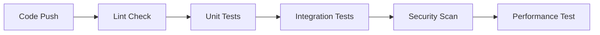
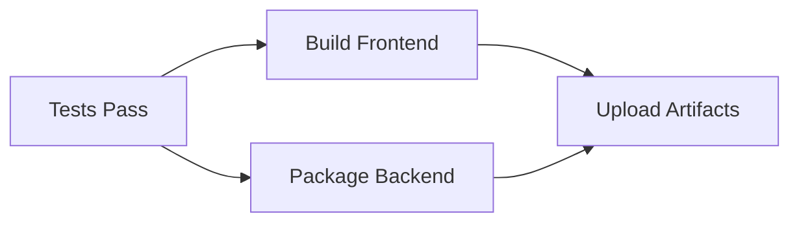
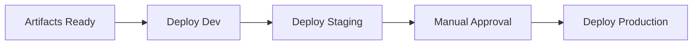

# CI/CD Pipeline Setup Guide

## 🚀 **Complete GitHub Actions CI/CD Pipeline**

This document provides a comprehensive guide to set up and configure the CI/CD pipeline for Qrytiv2 serverless architecture.

---

## 📋 **Pipeline Overview**

### **Workflows Created:**

1. **🔄 Continuous Integration (`ci.yml`)**
   - Code quality checks (ESLint, Flake8)
   - Frontend and backend testing
   - Integration testing
   - Performance analysis
   - Security scanning

2. **🚀 Backend Deployment (`deploy-backend.yml`)**
   - AWS Lambda functions deployment
   - DynamoDB table creation
   - Multi-environment support (dev/staging/prod)
   - Health checks and validation

3. **🎨 Frontend Deployment (`deploy-frontend.yml`)**
   - React application build and optimization
   - S3 deployment with CloudFront invalidation
   - Performance auditing with Lighthouse
   - Security scanning

4. **📦 Release Management (`release.yml`)**
   - Automated release creation
   - Asset packaging and distribution
   - Deployment documentation generation
   - Version management

---

## ⚙️ **Required GitHub Secrets**

### **AWS Credentials (Development/Staging)**
```
AWS_ACCESS_KEY_ID          # AWS access key for dev/staging
AWS_SECRET_ACCESS_KEY      # AWS secret key for dev/staging
```

### **AWS Credentials (Production)**
```
AWS_ACCESS_KEY_ID_PROD     # AWS access key for production
AWS_SECRET_ACCESS_KEY_PROD # AWS secret key for production
```

### **Application Secrets**
```
JWT_SECRET_DEV             # JWT secret for development
JWT_SECRET_STAGING         # JWT secret for staging  
JWT_SECRET_PROD            # JWT secret for production
SENDER_EMAIL               # Email address for AWS SES
```

### **Frontend Deployment**
```
S3_BUCKET_DEV                    # S3 bucket for development
S3_BUCKET_STAGING                # S3 bucket for staging
S3_BUCKET_PROD                   # S3 bucket for production
CLOUDFRONT_DISTRIBUTION_ID_DEV   # CloudFront distribution for dev
CLOUDFRONT_DISTRIBUTION_ID_STAGING # CloudFront distribution for staging
CLOUDFRONT_DISTRIBUTION_ID_PROD  # CloudFront distribution for prod
PRODUCTION_DOMAIN                # Production domain name
```

### **Optional Secrets**
```
LHCI_GITHUB_APP_TOKEN      # Lighthouse CI token (optional)
```

---

## 🔧 **Setup Instructions**

### **1. Configure GitHub Repository**

#### **Enable GitHub Actions**
1. Go to your repository settings
2. Navigate to "Actions" → "General"
3. Enable "Allow all actions and reusable workflows"

#### **Add Repository Secrets**
1. Go to "Settings" → "Secrets and variables" → "Actions"
2. Add all required secrets listed above
3. Ensure secret names match exactly

### **2. Configure AWS Resources**

#### **Create IAM User for CI/CD**
```bash
# Create IAM policy for CI/CD
aws iam create-policy \
  --policy-name QrytivCICDPolicy \
  --policy-document '{
    "Version": "2012-10-17",
    "Statement": [
      {
        "Effect": "Allow",
        "Action": [
          "lambda:*",
          "apigateway:*",
          "dynamodb:*",
          "s3:*",
          "cloudformation:*",
          "iam:PassRole",
          "iam:GetRole",
          "iam:CreateRole",
          "iam:DeleteRole",
          "iam:AttachRolePolicy",
          "iam:DetachRolePolicy",
          "logs:*",
          "cloudfront:CreateInvalidation"
        ],
        "Resource": "*"
      }
    ]
  }'

# Create IAM user
aws iam create-user --user-name qrytiv-cicd

# Attach policy to user
aws iam attach-user-policy \
  --user-name qrytiv-cicd \
  --policy-arn arn:aws:iam::YOUR_ACCOUNT_ID:policy/QrytivCICDPolicy

# Create access keys
aws iam create-access-key --user-name qrytiv-cicd
```

#### **Create S3 Buckets for Frontend**
```bash
# Development bucket
aws s3 mb s3://qrytiv-frontend-dev

# Staging bucket  
aws s3 mb s3://qrytiv-frontend-staging

# Production bucket
aws s3 mb s3://qrytiv-frontend-prod

# Configure bucket for static website hosting
aws s3 website s3://qrytiv-frontend-prod \
  --index-document index.html \
  --error-document index.html
```

#### **Create CloudFront Distributions (Optional)**
```bash
# Create CloudFront distribution for production
aws cloudfront create-distribution \
  --distribution-config file://cloudfront-config.json
```

### **3. Configure Environment-Specific Settings**

#### **GitHub Environments**
1. Go to "Settings" → "Environments"
2. Create environments: `development`, `staging`, `production`
3. Configure protection rules for production:
   - Required reviewers
   - Wait timer
   - Deployment branches

#### **Environment Variables per Stage**
```yaml
# Development
STAGE: dev
REGION: ap-south-1
JWT_SECRET: dev-secret-key

# Staging  
STAGE: staging
REGION: ap-south-1
JWT_SECRET: staging-secret-key

# Production
STAGE: prod
REGION: ap-south-1
JWT_SECRET: production-secret-key
```

---

## 🔄 **Workflow Triggers**

### **Continuous Integration**
- **Trigger:** Push to `main` or `develop` branches, Pull requests
- **Actions:** Code quality, testing, security scanning
- **Duration:** ~5-10 minutes

### **Backend Deployment**
- **Development:** Push to `develop` branch
- **Staging:** Push to `main` branch
- **Production:** Manual workflow dispatch with approval

### **Frontend Deployment**
- **Development:** Push to `develop` branch (frontend changes)
- **Staging:** Push to `main` branch (frontend changes)
- **Production:** Manual workflow dispatch with approval

### **Release Management**
- **Trigger:** Git tag creation (`v*.*.*`) or manual dispatch
- **Actions:** Create release, package assets, generate docs

---

## 📊 **Pipeline Stages**

### **Stage 1: Code Quality & Testing**


### **Stage 2: Build & Package**


### **Stage 3: Deployment**


---

## 🔍 **Monitoring & Alerts**

### **GitHub Actions Monitoring**
- **Workflow Status:** Monitor in Actions tab
- **Email Notifications:** Configure in repository settings
- **Slack Integration:** Add Slack webhook for notifications

### **AWS Monitoring**
- **CloudWatch Logs:** Monitor Lambda function logs
- **CloudWatch Metrics:** Track performance metrics
- **AWS Cost Explorer:** Monitor deployment costs

### **Performance Monitoring**
- **Lighthouse CI:** Automated performance auditing
- **Bundle Analysis:** Track frontend bundle size
- **Load Testing:** Monitor API response times

---

## 🚨 **Troubleshooting**

### **Common Issues**

#### **1. AWS Permissions Error**
```bash
# Check IAM permissions
aws iam simulate-principal-policy \
  --policy-source-arn arn:aws:iam::ACCOUNT:user/qrytiv-cicd \
  --action-names lambda:CreateFunction \
  --resource-arns "*"
```

#### **2. Serverless Deployment Fails**
```bash
# Check serverless configuration
serverless print --stage dev

# Validate CloudFormation template
aws cloudformation validate-template \
  --template-body file://infrastructure/dynamodb-tables.yml
```

#### **3. Frontend Build Fails**
```bash
# Check Node.js version compatibility
node --version
npm --version

# Clear cache and reinstall
npm ci --cache .npm --prefer-offline
```

#### **4. Environment Variables Missing**
- Verify all required secrets are set in GitHub
- Check secret names match exactly (case-sensitive)
- Ensure environment-specific secrets are configured

### **Debug Commands**
```bash
# Check GitHub Actions logs
gh run list --repo mandarwaghmare997/Qrytiv2

# View specific workflow run
gh run view RUN_ID --repo mandarwaghmare997/Qrytiv2

# Check AWS resources
aws lambda list-functions --region ap-south-1
aws dynamodb list-tables --region ap-south-1
aws s3 ls
```

---

## 📈 **Performance Optimization**

### **CI/CD Pipeline Optimization**
- **Parallel Jobs:** Run tests in parallel
- **Caching:** Cache dependencies between runs
- **Conditional Deployments:** Only deploy changed components
- **Artifact Reuse:** Share build artifacts between jobs

### **AWS Cost Optimization**
- **Lambda Provisioned Concurrency:** Only for production
- **DynamoDB On-Demand:** Use for variable workloads
- **S3 Lifecycle Policies:** Archive old deployment artifacts
- **CloudFront Caching:** Optimize cache settings

---

## 🔐 **Security Best Practices**

### **Secrets Management**
- **Rotate Secrets Regularly:** Update JWT secrets and AWS keys
- **Least Privilege:** Grant minimum required permissions
- **Environment Isolation:** Separate dev/staging/prod secrets
- **Audit Access:** Monitor secret usage

### **Code Security**
- **Dependency Scanning:** Automated vulnerability checks
- **Static Analysis:** Code quality and security scanning
- **Container Scanning:** If using Docker images
- **License Compliance:** Check open source licenses

---

## 📚 **Additional Resources**

### **Documentation**
- [GitHub Actions Documentation](https://docs.github.com/en/actions)
- [AWS Serverless Framework](https://www.serverless.com/framework/docs/)
- [AWS Lambda Best Practices](https://docs.aws.amazon.com/lambda/latest/dg/best-practices.html)

### **Tools**
- [Serverless Framework](https://www.serverless.com/)
- [AWS CLI](https://aws.amazon.com/cli/)
- [GitHub CLI](https://cli.github.com/)

### **Monitoring**
- [AWS CloudWatch](https://aws.amazon.com/cloudwatch/)
- [Lighthouse CI](https://github.com/GoogleChrome/lighthouse-ci)
- [Sentry](https://sentry.io/) (for error tracking)

---

## ✅ **Checklist**

### **Pre-Deployment**
- [ ] All GitHub secrets configured
- [ ] AWS IAM user created with proper permissions
- [ ] S3 buckets created for frontend hosting
- [ ] CloudFront distributions configured (optional)
- [ ] Environment-specific configurations set

### **Post-Deployment**
- [ ] All workflows running successfully
- [ ] Health checks passing
- [ ] Monitoring and alerts configured
- [ ] Documentation updated
- [ ] Team trained on CI/CD process

---

**🎉 Your CI/CD pipeline is now ready for production use!**

*Last Updated: August 8, 2025*

